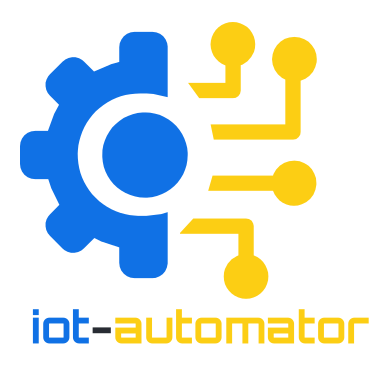

    
|tests|  

.. |tests| image:: https://github.com/mitchterrell/iot-automator/actions/workflows/tests.yml/badge.svg
   :target: https://github.com/mitchterrell/iot-automator/actions/workflows/tests.yml
   
   

TODO add python version, pip support, etc. here

What is ``iot-automator``?
-----------------------------

``iot-automator`` is a library for building complex IoT device automations using Python
with an emphasis on simplicity, robustness and scalability.

TODO add quick examples

TODO mention WebThings project

`Documentation is available on Read the Docs. <https://iot-automator.readthedocs.io/>`_

TODO add quick example

TODO Link a getting started tutorial

Why should I use ``iot-automator``?
--------------------------------

The development of ``websockets`` is shaped by four principles:

TODO Describe more

Why shouldn't I use ``iot-automator``?
-----------------------------------

TODO Describe more

What else?
----------

TODO license info, collaboration, etc. 
